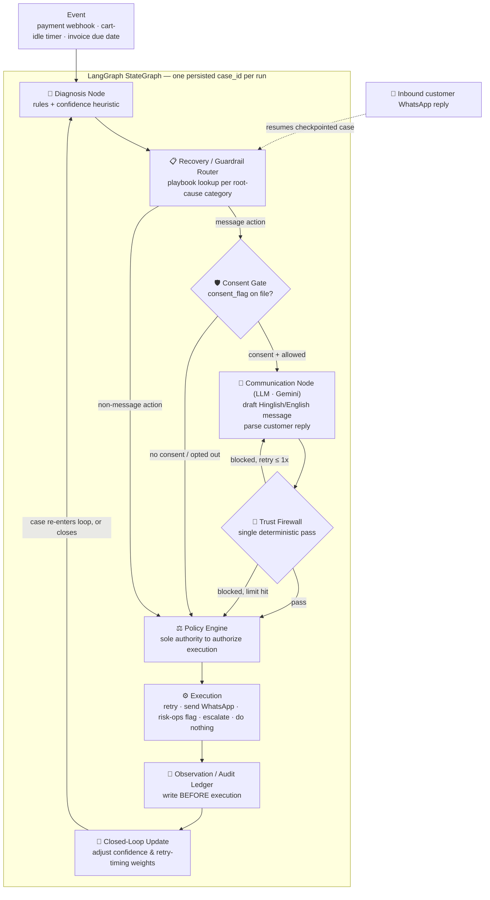

# RecoverAI — Root-Cause Revenue Recovery Agent

**Track 3 — AI Revenue Recovery:** *"Find revenue that's slipping away and win it back."*

> Don't just retry the payment. Understand *why* it failed, then act like a bounded, auditable agent — never mistakable for a scam.

RecoverAI is a single [LangGraph](https://github.com/langchain-ai/langgraph) agent that owns the full revenue-recovery lifecycle — **detect → diagnose → decide → act → observe → replan** — across the three places money quietly leaks out of a merchant's business, and proves it recovered real money against measured baselines.

---

## Table of Contents

- [The Problem (Track 3 brief)](#the-problem-track-3-brief)
- [How RecoverAI Solves It](#how-recoverai-solves-it)
- [Architecture](#architecture)
- [Root-Cause Taxonomy](#root-cause-taxonomy)
- [Guardrails](#guardrails)
- [Promise-to-Pay State Machine](#promise-to-pay-state-machine)
- [Core Features](#core-features)
- [Tech Stack](#tech-stack)
- [Project Layout](#project-layout)
- [Getting Started](#getting-started)
- [Evaluation](#evaluation)
- [Explicitly Out of Scope](#explicitly-out-of-scope)

---

## The Problem (Track 3 brief)

Revenue leaks out of a merchant's business at **three distinct moments**, and today each is handled by a separate, blunt tool:

| Leak point | What merchants do today |
|---|---|
| **Automated payment failures** (card declined, UPI mandate timeout, insufficient balance, bank server error, risk block) | Retry after a fixed delay for *every* failure, regardless of cause — wasting retries on unrecoverable failures and mistiming the ones that could actually succeed |
| **Checkout abandonment** | Do nothing, or send one generic, un-prioritized reminder |
| **Overdue B2B / subscription receivables** | Chase manually by phone/email in English — slow, doesn't scale, and doesn't match how Indian SMEs actually communicate (Hinglish, WhatsApp-first) |

All three are symptoms of one root problem: merchants treat *"payment didn't happen"* as a single bucket, when it's actually a handful of distinct problems that each need a different, specific response — and no existing tool reasons across all three at once.

A second, equally real problem: **any automated system that messages a customer about money owed looks and feels like a scam unless it is deliberately designed not to.** RecoverAI treats that as a first-class, structurally-enforced requirement — not a disclaimer.

---

## How RecoverAI Solves It

RecoverAI is genuinely agentic in the sense the brief asks for: it autonomously runs the perceive → diagnose → decide → act → observe → replan loop for a case **without a human driving each step**, across all three entry points, converging into one shared engine.

What it is deliberately **not**: an architecture where an LLM freely decides what to do at every step. Only one part of the loop actually requires language reasoning — talking to and understanding a human customer. Everywhere else the decision is **deterministic, table-driven, and auditable by design**.

| Node | Type | Job |
|---|---|---|
| **Supervisor** | Deterministic (graph state + edges) | The LangGraph state object + conditional edges *are* the supervisor — routes a case through the graph without an LLM call |
| **Diagnosis** | Deterministic (rules + heuristic) | Maps event / decline-code to a root-cause category with a confidence score |
| **Recovery / Guardrail Router** | Deterministic (playbook table) | Looks up the bounded playbook for the diagnosed category |
| **Consent Gate** | Deterministic (flag check) | Confirms consent exists before any outreach |
| **Communication** | **LLM (Gemini API)** | The *only* node that reasons in natural language — drafts the outbound message and parses the customer's free-text reply |
| **Trust Firewall** | Deterministic (single-pass filter) | Hard-blocks any message violating fixed rules before it can be sent |
| **Policy Engine** | Deterministic | Re-checks every guardrail; the *only* component allowed to authorize execution |
| **Execution** | Deterministic | Retry payment, send WhatsApp message, log a PTP, flag risk-ops, escalate, or do nothing |
| **Observation / Closed-loop Update** | Deterministic | Writes every decision to the audit ledger **before** execution; feeds outcomes back into confidence/timing weights |

Only **one of nine nodes is LLM-backed.** No node was added or split merely to look more agentic — the "agentic" property comes from the system's autonomous, closed-loop control over the case lifecycle, not from LLM count.

---

## Architecture



**Why LangGraph specifically:**
- The recovery lifecycle is a real state machine with cycles (retry → observe → replan, PTP broken → renegotiate) — LangGraph represents this natively as nodes and edges instead of scattered if-statements.
- Three entry points (`failure`, `abandonment`, `receivable`) converge into one shared engine.
- Persistent, resumable state per case (a case can sit in `NEGOTIATING` for days waiting on a promised date) maps directly to LangGraph's SQLite checkpointing.
- Guardrails become **graph topology**, not application logic that can be accidentally bypassed: the Consent Gate and Policy Engine sit on every path structurally — this is demoable as a diagram, not just asserted in prose.

---

## Root-Cause Taxonomy

| # | Category | Recoverable? | Handling |
|---|---|---|---|
| 1 | **Insufficient Balance** | Yes, with timing | Retry near a predicted better time; escalate to negotiation after 2 failed retries |
| 2 | **Card Expired / Invalid** | No, by retry | No retry — single "update your card" prompt, in-app link only |
| 3 | **Risk / Fraud Block** | N/A — not this system's call | Identified and classified only; no retry, no customer messaging; silently routed to the risk-ops queue |
| 4 | **Overdue Invoice (B2B)** | Via negotiation | No auto-retry — goes straight to the Communication node for PTP negotiation |
| 5 | **Abandoned Checkout** | Via nudge | No retry — one low-pressure nudge referencing the exact item/cart value |
| 6 | **Technical / Unclassified** (timeouts, mandate failures, low-confidence cases) | Uncertain | One safe retry/refresh attempt if confidence is adequate; below threshold → human review, never guessed |

**Confidence is a deterministic heuristic, not a trained model.** An exact known decline-code match yields high confidence; a partial/ambiguous match or a first-seen pattern yields lower confidence (`app/rules/confidence_heuristic.py`, `app/rules/root_cause_rules.yaml` — sourced from Razorpay's published error codes). This preserves the "act conservatively under uncertainty" guardrail without a training pipeline or labeled dataset.

On **Risk/Fraud Block**: RecoverAI does not attempt fraud detection. Its job is limited to identification and silent routing to a risk-ops queue — no autonomous action, no customer contact, ever.

---

## Guardrails

Every hard limit lives in exactly one place — [`app/config.py`](app/config.py) — so it's auditable as a single reviewable list, not scattered across nodes:

| Guardrail | Value |
|---|---|
| Max automated retries per failure, ever | **2** (`MAX_AUTO_RETRIES`) |
| Max outbound customer contacts before mandatory human escalation | **3** (`MAX_CUSTOMER_CONTACTS`) |
| Permitted contact hours (local time) | **9 AM – 8 PM** (`CONTACT_HOURS`) |
| Confidence floor for autonomous action | **0.70** (`CONFIDENCE_THRESHOLD`) |
| Max PTP date extension from original due date | **30 days** (`PTP_MAX_DATE_EXTENSION_DAYS`) |
| Max Trust Firewall regenerations before escalation | **1** (`TRUST_FIREWALL_MAX_REGENERATIONS`) |
| Max PTP renegotiations before escalation | **1** (`PTP_MAX_RENEGOTIATIONS`) |
| Opt-out | Any `"stop"` / `"unsubscribe"` / `"बंद करो"`-style reply **permanently** disables outreach on that channel — deterministic keyword match, checked *before* the LLM ever sees the reply |

**Consent Gate** — a boolean `consent_flag` per `(customer_id, channel)`, checked before *any* outreach. No consent → the case is logged as `DO NOTHING` with reason `"no consent on file"`.

**Trust Firewall** — a single deterministic pass runs on *every* outbound message before it can be sent. Hard-blocked (and regenerated once, then escalated) if it:
- Contains any link other than the fixed "open your app" instruction
- Contains urgency/threat language ("immediately," "last chance," "account will be suspended")
- Requests OTP, card number, CVV, or bank credentials
- Lacks a specific, verifiable reference (order ID / invoice number / exact amount)
- Proposes any change to amount, discount, fee, or a date beyond the configured PTP window

**Policy Engine** — the sole executor of any proposed action; independently re-checks consent, contact limits, contact hours, retry caps, confidence, and dispute status before authorizing anything (`app/graph/nodes/policy_engine.py`). Every authorization/rejection is written to `PolicyDecision` and `AuditLogEntry` **before** execution.

**Idempotency** — each failure event carries a single `already_attempted` flag per retry slot (`RetryAttempt`); a scheduled retry is skipped and logged if the flag is already set — no double-charging.

---

## Promise-to-Pay State Machine

The full PTP lifecycle, including its renegotiation loop, is the clearest demonstration of bounded, stateful agentic behavior in the system:

```
DETECTED → CONTACTED → NEGOTIATING → PROMISED → [KEPT | BROKEN]
                                          │
                                          ▼
                                      DISPUTED → ESCALATED (immediate, no further automation)

BROKEN → RENEGOTIATE (max 1×) → ESCALATED
```

- **DETECTED** — root-cause engine flags a case for negotiation, having already passed the Consent Gate
- **CONTACTED** — first message sent, post Trust Firewall
- **NEGOTIATING** — customer replies; LLM parses intent (date, amount, dispute, refusal); any proposed date is checked against configured PTP limits
- **PROMISED** — structured PTP logged: `{amount, promised_date, channel}`, always within negotiation limits
- **KEPT** — verified against settlement data, never by asking the customer
- **BROKEN** — promised date passed with no matching payment → one renegotiation allowed, then escalation on a second break
- **DISPUTED** — any explicit dispute → immediate stop on all automation, escalated to human collections with full history

Implemented in [`app/rules/ptp_state_machine.py`](app/rules/ptp_state_machine.py) as pure functions consumed by the Recovery Router.

---

## Core Features

- **Three entry points, one engine** — payment failures, checkout abandonment, and overdue receivables all flow through the same diagnose → decide → act → observe loop (`app/graph/build_graph.py`).
- **Deterministic root-cause diagnosis** against Razorpay's published error taxonomy, with an explainable confidence score instead of a black-box classifier.
- **Bounded playbooks per category** (`app/rules/playbook_table.yaml`) — the LLM never chooses *what* action to take, only *how* to phrase it.
- **Hinglish/English WhatsApp negotiation** via Gemini + Twilio, with structured intent parsing (promise date, dispute, refusal, opt-out, payment confirmation) — the only LLM-backed node in the graph.
- **Trust Firewall** that cannot be talked out of its rules by the LLM, regardless of prompt.
- **Independent Policy Engine authorization** — every execution is re-validated against every guardrail immediately before it happens, not just proposed by an earlier node.
- **Append-only audit ledger** — every decision (act *or* deliberately not act) is written with an actor, a reason, and a timestamp *before* execution (`AuditLogEntry`, SQLite trigger-enforced immutability).
- **Closed-loop learning** — the Observation node feeds outcomes back into the Diagnosis confidence heuristic and the Recovery Router's retry-timing weights, deterministically (no LLM in the learning step, so it stays fully inspectable).
- **Idempotent, resumable case state** — LangGraph SQLite checkpointing means a case can sit in `NEGOTIATING` for days and resume exactly where it left off when the customer replies.
- **Reproducible offline evaluation harness** — a synthetic batch with hidden ground-truth recoverability profiles, a transparent weighted-probability customer simulator, and a three-way comparison against `do_nothing` and `naive` baselines.
- **Streamlit operations dashboard** — submit live cases, inspect a fully-traced case end to end, and compare recovery/false-intervention/escalation metrics across conditions.
- **Real webhook integrations** — Razorpay (`payment.failed` / `payment.authorized`) and Twilio WhatsApp inbound/outbound, both signature-verified.

---

## Tech Stack

| Layer | Choice | Why |
|---|---|---|
| Orchestration / agent framework | **LangGraph** (`StateGraph`) | Native support for stateful cycles, conditional branching, multi-entry-point convergence, and checkpointed persistence — the graph topology itself enforces guardrail placement |
| LLM (message generation, Hinglish negotiation, intent parsing) | **Gemini API** (Gemini Flash) | Strong Hinglish/code-mixed generation and reliable structured JSON output for intent parsing, at zero cost; used in exactly one node |
| LLM orchestration helpers | **LangChain** | Structured-output enforcement and prompt templating for the single Communication node |
| Root-cause rule engine | Plain Python, config-driven YAML table | Deterministic, auditable, inspectable in seconds |
| Confidence heuristic | Plain Python pattern-match scoring | Preserves the low-confidence → human-review guardrail without a training/labeling pipeline |
| Consent Gate | Plain Python boolean flag check | Simple, deterministic fact lookup |
| Trust Firewall | Plain Python regex/keyword filter | Single-pass, cannot be overridden by the LLM |
| Policy Engine | Plain Python deterministic module | Sole executor of any proposed tool call; re-checks every guardrail |
| Messaging channel | **Twilio WhatsApp API** | Real WhatsApp delivery/receipt without building a full WhatsApp Business API integration from scratch |
| Payment data | **Razorpay test-mode APIs** (Payments, Webhooks) | Realistic failure codes, track-aligned |
| Backend | **FastAPI** | Async-friendly for webhook + Twilio callback handling |
| Database / persistent state | **SQLite** (SQLAlchemy ORM) | Audit ledger, PTP state, consent flags, and LangGraph checkpointing all in one file-based store |
| Audit ledger | Append-only SQLite table (`AuditLogEntry`) | Every row = one decision event, written before execution |
| Dashboard | **Streamlit** | ₹ recovered, uplift vs. baselines, category/entry-point breakdown, escalation breakdown — minimal frontend overhead |
| Customer response simulator | Plain Python weighted-probability function | Reproducible, inspectable, no second LLM persona needed |
| Testing | **pytest** | Unit + integration coverage per guardrail/node |

---


## Project Layout

```
app/
├── graph/            # LangGraph state, nodes (diagnosis, consent_gate, communication,
│                      # trust_firewall, policy_engine, execution, observation, ...),
│                      # and conditional-edge routing
├── models/           # SQLAlchemy entities (mirrors the Data Model above)
├── integrations/      # Razorpay, Twilio WhatsApp, Gemini API adapters (all dry-run capable)
├── rules/             # Root-cause rule table, confidence heuristic, playbook table,
│                      # abandonment scorer, PTP state machine, consent store
├── db/                # SQLite engine/session, LangGraph checkpointer
├── api/               # FastAPI routes + webhook receivers
└── config.py           # Single source of truth for every guardrail constant

evaluation/            # Synthetic batch generator, customer simulator, baselines, metrics
dashboard/             # Streamlit operations + evaluation dashboard
tests/                 # Unit/integration tests, one file per guardrail or node
data/                  # Synthetic batches and seed data
```

---

## Getting Started

```bash
# 1. Install dependencies
make install

# 2. Configure environment (Gemini / Razorpay / Twilio keys are optional —
#    DRY_RUN=true by default, so the whole system runs with zero live credentials)
cp .env.example .env

# 3. Run the API (FastAPI + LangGraph, SQLite-backed)
make api          # http://localhost:8000

# 4. Run the dashboard
make dashboard     # http://localhost:8501

# 5. Run the offline evaluation batch (do_nothing vs. naive vs. RecoverAI)
make evaluate

# 6. Run the test suite
make test
```

Or via Docker Compose:

```bash
docker compose up --build api dashboard
docker compose --profile evaluation run --rm evaluator
```

---


## Evaluation

A 100-case synthetic batch (fixed seed, hidden recoverability ground truth per case, weighted-probability customer simulator — `evaluation/`) is run through three identical conditions:

| Condition | ₹ Recovered | Recovery Rate | False Interventions | Escalations |
|---|---|---|---|---|
| **Do nothing** | ₹0 | 0.0% | 0 | 0 |
| **Naive baseline** (retry everything, generic reminder, no routing/consent/idempotency) | ₹27,250 | 4.75% | **3** | 0 |
| **RecoverAI** | ₹19,000 | 3.31% | **0** | 74 |

The naive baseline recovers a larger raw amount by ignoring guardrails entirely — including retrying a **risk/fraud-blocked** payment and messaging customers with **no consent on file**, each logged as a false intervention. RecoverAI recovers less in absolute terms on this batch, but with **zero unsafe or unauthorized actions**: every one of its 74 escalations is a case correctly withheld — no consent, sub-threshold confidence, or risk-blocked — rather than a miss. The full breakdown (by root-cause category, by entry point, escalation triggers, and the do-nothing/naive/RecoverAI comparison) is available live on the Streamlit dashboard and in [`evaluation/results.json`](evaluation/results.json).

---

## Explicitly Out of Scope

- No payment links generated or sent by the agent, ever
- No fraud/risk decisioning — risk-blocked cases are identified and routed only, never scored
- No handling of sensitive authentication data (OTP / CVV / bank login)
- No autonomous mandate creation — only refresh prompts for existing mandates
- No autonomous change to payment amount, fees, discounts, or any contractual term
- No outreach to a customer without a valid, on-file consent flag for that channel
- No trained ML model — confidence is a deterministic heuristic by design